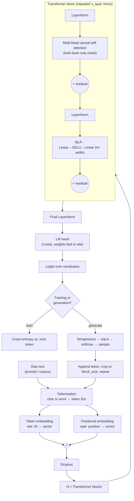

# NanoChat‑X 🧠💬

A **from‑scratch causal GPT** you can read end to end, inspired by Andrej
Karpathy's teaching style. NanoChat‑X trains a small decoder‑only transformer on
plain text — no downloads, no pretrained weights, no API keys — so every moving
part of a GPT‑like model is visible in a few hundred lines.

> **Fully offline.** The tokenizer, model and training loop are all hand‑written
> and train on a local text file, so nothing here depends on Hugging Face or any
> network access.

---

## What's inside (the "NanoScope" core-DL build)

| Piece | Where | Notes |
| --- | --- | --- |
| Causal GPT | [`src/model.py`](src/model.py) | Hand‑written multi‑head **causal** self‑attention, pre‑LN residual blocks, 4× MLP, weight‑tied LM head, GPT‑2 scaled init |
| Config | [`src/config.py`](src/config.py) | One `GPTConfig` + `TrainConfig`; every field is a CLI flag and is saved into the checkpoint |
| Tokenizers | [`src/tokenizer.py`](src/tokenizer.py) | `char` (default, tiny + fully reversible) or `word`; save/load so inference uses the exact training vocab |
| Data | [`src/data.py`](src/data.py) | Train/val split + random contiguous batches |
| Training | [`src/train.py`](src/train.py) | AdamW w/ weight‑decay groups, warmup→cosine LR, grad clipping, gradient accumulation, AMP (auto on CUDA), periodic eval, best‑checkpoint + `--resume`, CSV loss log |
| Generation | `generate()` + [`src/sample.py`](src/sample.py) / [`src/chat.py`](src/chat.py) | Temperature + top‑k, **context cropped to `block_size`** |
| Tests | [`tests/test_nanochat.py`](tests/test_nanochat.py) | Shapes, tokenizer round‑trip, loss‑decreases smoke test, and a **causal no‑future‑leak** property test |

> Earlier versions used a bidirectional `nn.TransformerEncoder` with **no causal
> mask** — during training each position could see the token it was meant to
> predict, and generation crashed once the sequence passed `max_seq_len`. Both
> are fixed here; `test_causal_mask_no_future_leak` guards against regressions.

---

## Architecture — the forward pass

How a prompt becomes the next token, end to end:


```text
            Raw text  (prompt / corpus)
                 |
                 v
        +-------------------+
        |   Tokenization    |   char or word  ->  token IDs
        +-------------------+
                 |
        +--------+---------+
        v                  v
  +-----------+     +---------------+
  |   Token   |     |  Positional   |
  | embedding |     |   embedding   |
  |  (wte)    |     |    (wpe)      |
  +-----------+     +---------------+
        \                  /
         \                /
          v              v
            +-----------+
            |    ( + )   |   sum embeddings
            +-----------+
                 |
                 v
            +-----------+
            |  Dropout  |
            +-----------+
                 |
                 v
  ==================================================
  ||   N x Transformer block  (repeat n_layer)    ||
  ||                                               ||
  ||     LayerNorm                                 ||
  ||        |                                      ||
  ||        v                                      ||
  ||   Multi-head CAUSAL self-attention            ||
  ||   (each token attends only to itself + past)  ||
  ||        |                                      ||
  ||        +--> ( + ) residual                    ||
  ||               |                               ||
  ||               v                               ||
  ||           LayerNorm                           ||
  ||               |                               ||
  ||               v                               ||
  ||     MLP: Linear -> GELU -> Linear (4x width)  ||
  ||               |                               ||
  ||               +--> ( + ) residual             ||
  ==================================================
                 |
                 v
        +-------------------+
        | Final LayerNorm   |
        +-------------------+
                 |
                 v
        +-------------------+
        | LM head (Linear,  |   weights tied to wte
        | tied to embedding)|
        +-------------------+
                 |
                 v
         Logits over vocabulary
                 |
        +--------+-----------------------------+
        | training                    generate |
        v                                      v
 Cross-entropy vs.            Temperature -> top-k ->
 the next token               softmax -> sample one token
                                      |
                                      v
                         append token, crop to block_size,
                              feed back in  (loop) ---> Tokenization
```

<details>
<summary>Mermaid version (renders on GitHub / with a Mermaid-enabled viewer)</summary>



</details>

Where each stage lives in the code:

| Stage | Code |
| --- | --- |
| Tokenization | [`src/tokenizer.py`](src/tokenizer.py) |
| Token + positional embeddings, blocks, LM head | [`src/model.py`](src/model.py) · `NanoGPT` |
| Multi-head causal self-attention | [`src/model.py`](src/model.py) · `CausalSelfAttention` |
| MLP (feed-forward) | [`src/model.py`](src/model.py) · `MLP` |
| Cross-entropy loss / training | [`src/train.py`](src/train.py) |
| Temperature / top-k sampling | [`src/model.py`](src/model.py) · `NanoGPT.generate` |

---

## Getting started

```bash
pip install -r requirements.txt        # torch, numpy, pytest
```

### 1. (Optional) build the dataset
A toy `data/data.txt` works out of the box. To use the Cornell Movie‑Dialogs
corpus (raw files already under `data/cornell_movie_dialogs/`):

```bash
python -m src.preprocess_cornell        # writes line -> reply pairs to data/data.txt
```

### 2. Train

```bash
python -m src.train                                   # sensible defaults (char tokenizer)
python -m src.train --max_iters 3000 --n_layer 6 --n_embd 256
python -m src.train --tokenizer word --block_size 64
python -m src.train --resume                          # continue from out/ckpt.pt
```

Checkpoints, the tokenizer vocab, and a `loss.csv` (train/val loss over time)
land in `out/`.

### 3. Sample / chat

```bash
python -m src.sample --prompt "The thing is " --max_new_tokens 200 --top_k 40
python -m src.chat                                    # interactive completion loop
```

With the Cornell data (`line -> reply` format), `chat.py` prompts the model with
`your text ->` to nudge it toward reply‑shaped completions.

### 4. Test

```bash
python -m pytest -q
```

---

## How it works (the one‑paragraph version)

Text → token ids (`tokenizer.py`). The model adds a learned token embedding and a
learned positional embedding, then runs a stack of transformer blocks. Each block
does **causal** self‑attention (a token attends only to itself and earlier
tokens) followed by an MLP, both wrapped in pre‑LayerNorm residuals. A final
LayerNorm + linear head produce next‑token logits, trained with cross‑entropy.
Generation samples one token at a time, always feeding back the last
`block_size` tokens.

---

## 🎯 Goal

NanoChat‑X is a **learning project**, not a production chatbot: a hands‑on way to
understand — and be able to *rebuild* — how GPT‑like models work, end to end.

---

## Run (quickstart)

```bash
cd "Projects/NanoChat-X"
pip install -r requirements.txt

python -m src.train --max_iters 3000 --n_layer 6 --n_embd 256   # a real run: ~minutes on CPU
python -m src.sample --prompt "The thing is " --top_k 40         # generate from the checkpoint
python -m pytest -q                                              # run the tests
```

See [Getting started](#getting-started) above for the full set of flags and the
optional Cornell dataset build.

---

## Web UI

A static single-page console (no Node build) served by FastAPI, styled with the
**USWDS design system** — default light theme, **Montserrat** throughout,
accessible focus states and a skip link.

```bash
pip install -r requirements.txt          # includes fastapi, uvicorn, pydantic
python -m src.train                      # train a checkpoint first (writes out/ckpt.pt)
python -m src.server                     # http://127.0.0.1:8000
python -m src.server --port 8080 --ckpt out/ckpt.pt
```

Open the URL and enter a prompt; sliders control max tokens, temperature and
top-k. The page loads its model info from the API and disables generation with a
clear message if no checkpoint exists yet.

| Piece | Where | Notes |
| --- | --- | --- |
| Server | [`src/server.py`](src/server.py) | Serves the SPA, loads the checkpoint once at startup |
| `GET /api/health` | | Reports whether a model is loaded + its config (layers, heads, params, device) |
| `POST /api/generate` | | `{prompt, max_new_tokens, temperature, top_k}` → generated text |
| Interactive API docs | `/docs` | FastAPI's built-in Swagger UI |
| Front-end | [`web/`](web/) | `index.html`, `styles.css` (USWDS tokens), `app.js` |

> The font loads from Google Fonts; if your network blocks it, the CSS falls
> back to a USWDS-style system stack (Public Sans → system-ui) automatically.


