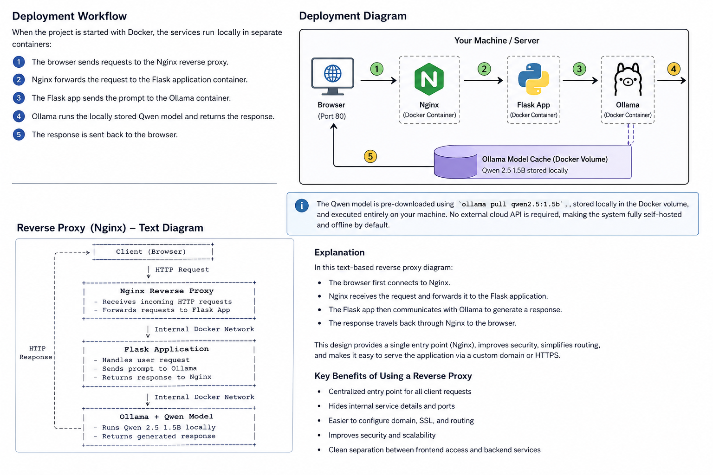
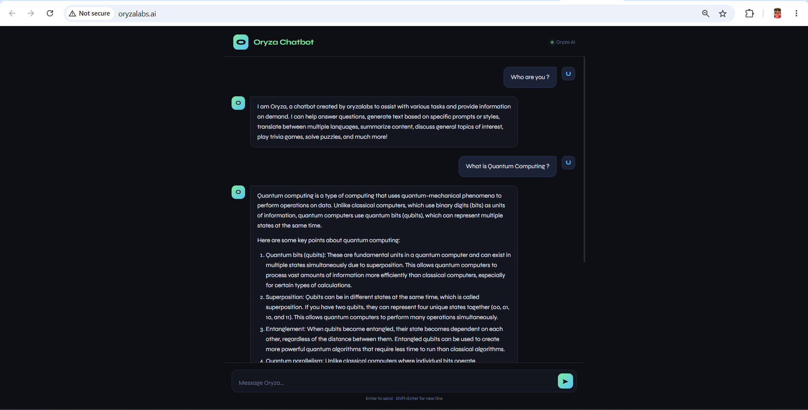

# Oryza Chatbot

Oryza Chatbot is a Flask-based web application that uses the Qwen 2.5 1.5B language model through Ollama as the backend AI assistant. The system is containerized with Docker, exposed through a reverse proxy, and designed for self-hosted deployment with local inference and privacy-friendly operation.

## Overview

This project implements a lightweight chatbot stack with the following components:

> Note: When deployed with Docker, the application runs as a self-hosted local system. The Qwen model is executed through Ollama on the host machine/server, so it can operate offline as long as the model is already available locally.

- A Python Flask application serving the web interface
- A backend integration to Ollama for local LLM inference
- The Qwen 2.5 1.5B model as the conversational AI engine
- Docker-based deployment for portability and reproducibility
- Nginx as a reverse proxy for production-style routing

## Architecture

The application follows a simple request flow:

1. The user submits a prompt through the Flask web UI.
2. The Flask server forwards the request to the Ollama API endpoint.
3. Ollama runs the selected Qwen model locally and returns the generated response.
4. The Flask app renders the response in the browser.

This architecture keeps the model execution local while exposing a simple, browser-based interface.

## Technical Stack

- Python 3.10+
- Flask for the web layer
- Requests for HTTP communication
- Ollama for local model serving
- Qwen 2.5 1.5B as the AI assistant model
- Docker and Docker Compose for container orchestration
- Nginx for reverse proxying
- HTML, CSS, and JavaScript for the frontend UI

## Project Structure

```text
Qwen-Chat/
├── app/
│   └── main.py
├── templates/
│   └── index.html
├── docker-compose.yml
├── Dockerfile
├── nginx.conf
├── requirements.txt
└── Readme.md
```

## Core Implementation Details

### Flask Web Interface

The Flask app handles:

- HTTP request routing for the chat page
- Form submission handling for user prompts
- Communication with the Ollama API
- Response formatting for the frontend

### Ollama + Qwen Model Integration

The chatbot uses Ollama as the model runtime layer. The application is configured to call a locally hosted model such as:

```bash
ollama pull qwen2.5:1.5b
```

This allows the project to run the Qwen model without relying on external cloud inference services.

### Docker Deployment

The project is packaged as Docker containers for:

- The Flask application
- Ollama runtime
- Nginx reverse proxy

This makes the deployment consistent across development and production environments.

## Prerequisites

Before running the project, ensure the following are installed:

- Python 3.10+
- Docker and Docker Compose
- Ollama
- A pulled local model, for example:

```bash
ollama pull qwen2.5:1.5b
```

## Local Development

Create and activate a virtual environment:

```bash
python -m venv venv
source venv/bin/activate
```

Install dependencies:

```bash
pip install -r requirements.txt
```

Run the Flask app locally:

```bash
python app/main.py
```

Open the interface at:

```text
http://localhost:5000
```

## Docker Deployment

From the project root, build and start the services:

```bash
docker compose up -d --build
```

The application will be available through the proxy at:

```text
http://localhost/
```

For a custom domain, update the host configuration in nginx.conf and point your DNS records to the server IP address.

## Environment and Configuration

The application can be configured through environment variables and runtime settings such as:

- Ollama host endpoint
- Selected model name
- Application port
- Reverse proxy host mapping



## User Interface



## Future Improvements

- Conversation history persistence
- Streaming responses
- Multiple model selection
- Authentication and authorization
- Persistent session management
- HTTPS with Let’s Encrypt

## License

This project is licensed under the MIT License.

## Author

Oryza Labs - Rushikesh Mohalkar
