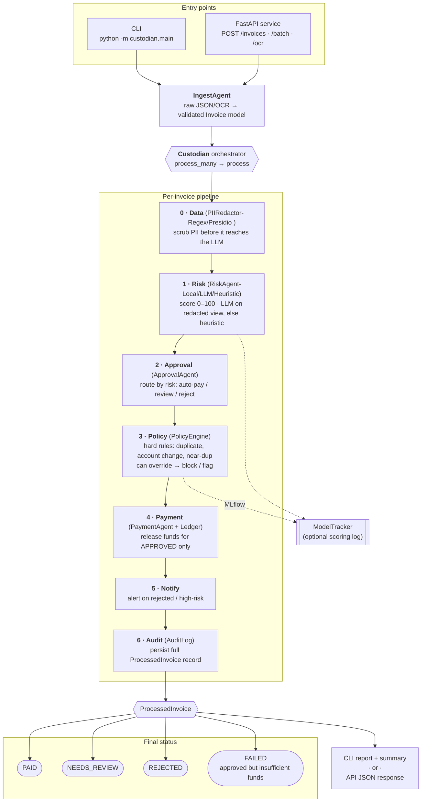

# Custodian — Accounts-Payable Pipeline (End-to-End)

A compact map of how an invoice flows from entry to a persisted decision.
Every step appends to the invoice's **audit trail** — the core governance promise.

## Flow

## Stage cheat-sheet

| # | Stage | Module | Responsibility |
|---|-------|--------|----------------|
| — | Ingest | `agents/ingest.py` | Load & validate invoices (dir of JSON, OCR, or API body) |
| 0 | Data | `governance/data.py` | Redact PII before any LLM call |
| 1 | Risk | `agents/risk.py` + `llm.py` | Fraud/risk score; LLM via LiteLLM or heuristic fallback |
| 2 | Approval | `agents/approval.py` | Risk-based routing decision |
| 3 | Policy | `governance/policy.py`, `dedup.py` | Deterministic rules; can override approval |
| 4 | Payment | `agents/payment.py`, `ledger.py` | Release funds for approved invoices |
| 5 | Notify | `notify.py` | Alert on rejected / high-risk |
| 6 | Audit | `governance/audit.py` | Append-only persisted record |

- A memo (or destination tag) in Ledger is an extra piece of text or numbers required when sending specific cryptocurrencies to a centralized exchange.

- Governance 
  - Duplicate Defection 
  - Vendor Account Change (BEC/Impersonation Detection)
  - Near Duplicate Detection 
  - Amount Validation
  - Absolute Spending Ceiling
  - Blocked Vendors (Denylist)
  - Weak Vendor Account - Vendor account is missing or too short...
  
- Notifier Backends:
    - WebhookNotifier - POST to CUSTODIAN_WEBHOOK_URL
    - LogNotifier - Write to CUSTODIAN_NOTIFY_LOG_PATH
    - MultiNotifier - Chain both
  
- Audit 
  - File-based JSONL (default)
    - AuditLog class
    - One JSON line per invoice, append mode

  - SQLite-based (production)
    - SqliteAuditLog (from src/custodian/db.py)
    - Stores recorded_at, audit_id, full invoice snapshot